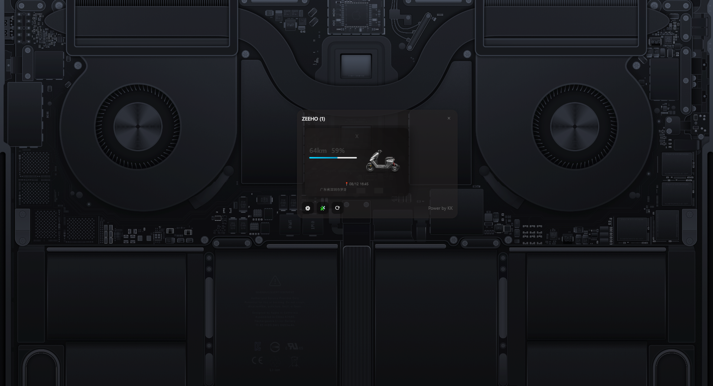

# ZEEHO Widget

A desktop widget application for displaying ZEEHO electric motorcycle status information.



[中文文档](./README.zh-CN.md) | English

## Features

-   🚀 Real-time vehicle status display
-   🔋 Battery level and remaining range display
-   📍 Vehicle location information (based on Amap)
-   ⚡ Charging status indicator
-   🔄 Automatic data refresh
-   🎨 Beautiful frosted glass effect interface
-   📱 Multi-vehicle support

## System Requirements

-   Windows 10/11
-   Internet connection required for vehicle data

## Quick Start

### Step 1: Obtain Token

#### Method 1: Using Packet Capture Tools (Recommended)

1. **Download and Install Packet Capture Tools**

    - Recommended: [Charles](https://www.charlesproxy.com/) or [Fiddler](https://www.telerik.com/fiddler)
    - Or use mobile packet capture tools like [HttpCanary](https://httpcanary.com/) (Android)

2. **Configure Mobile Proxy**

    - Ensure your phone and computer are on the same WiFi network
    - Configure HTTP proxy in your phone's WiFi settings
    - Proxy server: Computer's IP address
    - Port: Default port of capture tool (Charles: 8888, Fiddler: 8888)

3. **Install Certificate (HTTPS Capture)**

    - Generate and install SSL certificate in the capture tool
    - Visit `chls.pro/ssl` (Charles) or corresponding certificate download page on your phone
    - Download and install certificate on your phone

4. **Start Capturing**

    - Launch the capture tool
    - Open ZEEHO app on your phone
    - Log in to your account

5. **Find Token**
    - In the capture tool, look for requests containing `tapi.zeehoev.com`
    - Find any API request and check the request headers
    - Copy the value from the `Authorization` field, format: `Bearer xxxxxxxxxx`
    - **Important**: Only copy the part after `Bearer ` as your Token

#### Method 2: Browser Developer Tools

1. **Use Computer Browser**

    - Open Chrome or Edge browser
    - Press F12 to open developer tools
    - Switch to Network tab

2. **Visit ZEEHO Official Website**

    - Visit [ZEEHO Official Website](https://www.zeehoev.com/)
    - Try to log in (if web login is available)

3. **Find Token**
    - In the Network tab, find requests containing authentication information
    - Check the Authorization field in request headers

### Step 2: Configure Software

1. **Launch Application**

    - Double-click `zeeho-widgets.exe` to start the program
    - Configuration window will automatically pop up on first launch

2. **Fill Configuration Information**

    - **Token**: Paste the Token obtained from packet capture (without "Bearer " prefix)
    - **Update Interval**: Set data refresh interval (recommended 5-10 minutes)

3. **Save Configuration**
    - Click "Save Configuration" button
    - System will automatically validate Token validity
    - Vehicle data will load automatically after successful validation

### Step 3: Using the Widget

1. **View Vehicle Information**

    - Main interface displays all bound vehicles
    - Each vehicle card shows:
        - Vehicle name
        - Battery percentage
        - Remaining range
        - Charging status (if charging)
        - Last location information

2. **Control Buttons**
    - ⚙️ **Settings**: Reopen configuration window
    - 🧩 **Widget**: Launch desktop widget mode
    - ⟳ **Refresh**: Manually refresh data
    - × **Close**: Exit program

## Detailed Configuration

### Token Acquisition Detailed Steps

#### Using Charles for Packet Capture (Detailed Steps)

1. **Download and Install Charles**

    ```
    Official website: https://www.charlesproxy.com/
    Free trial for 30 days, 30 minutes per session
    ```

2. **Configure Charles**

    - Launch Charles
    - Menu: Proxy → Proxy Settings
    - Confirm port is 8888 (default)
    - Check "Enable transparent HTTP proxying"

3. **Mobile Proxy Settings**

    - Connect phone to WiFi
    - Long press WiFi name → Modify network
    - Advanced options → Proxy → Manual
    - Proxy hostname: Computer's IP address (displayed in Charles interface)
    - Proxy port: 8888

4. **Install SSL Certificate**

    - Visit `chls.pro/ssl` on phone browser
    - Download and install certificate
    - Android: Settings → Security → Encryption & credentials → Install certificate
    - iOS: Settings → General → Profiles → Install certificate

5. **Start Capturing**
    - Click start recording in Charles
    - Open ZEEHO app on phone and log in
    - Find requests related to `tapi.zeehoev.com` in Charles
    - Click request → View Request → Headers
    - Copy Authorization field value (remove "Bearer " prefix)

#### Using HttpCanary for Packet Capture (Android Recommended)

1. **Install Application**

    - Download HttpCanary (Yellow Bird)
    - Grant necessary permissions

2. **Configure Capture**

    - Open HttpCanary
    - Click play button in bottom right to start capturing
    - Install CA certificate (follow prompts)

3. **Obtain Token**
    - Switch to ZEEHO app
    - Perform login or refresh operations
    - Return to HttpCanary to view capture records
    - Find requests to `tapi.zeehoev.com`
    - View Authorization header in request details

### Configuration File Description

Configuration file saved at: `%USERPROFILE%\.zeeho-config.json`

```json
{
    "token": "your_token_here",
    "vehicleId": "",
    "updateInterval": 5
}
```

-   `token`: Authentication token obtained from packet capture
-   `vehicleId`: Vehicle ID (optional, leave empty to display all vehicles)
-   `updateInterval`: Data update interval (minutes)

## Troubleshooting

### Common Issues

1. **Token Validation Failed**

    - Confirm Token is copied completely without extra spaces
    - Confirm Token doesn't include "Bearer " prefix
    - Token may have expired, need to obtain new one

2. **Cannot Get Vehicle Data**

    - Check network connection
    - Confirm ZEEHO app works normally
    - Try obtaining new Token

3. **Cannot Capture HTTPS Data**

    - Confirm SSL certificate is installed correctly
    - Check if certificate is trusted
    - Try restarting phone and capture again

4. **Program Startup Failed**
    - Confirm system version support (Windows 10/11)
    - Check if blocked by antivirus software
    - Try running as administrator

### Token Validity Description

-   Tokens typically have a certain validity period
-   If authentication fails, you may need to obtain a new Token
-   Recommend updating Token regularly to ensure normal program operation

### Security Tips

-   Token contains sensitive information, do not share with others
-   Recommend changing ZEEHO account password regularly
-   Do not perform packet capture in public network environments

## Development

This project is based on the following technology stack:

-   Backend: Go + Wails v2 framework
-   Frontend: Vue 3 + Vite
-   Interface: Modern frosted glass effect design

### Build and Run

```bash
# Install dependencies
go mod tidy
cd frontend && npm install

# Development mode
wails dev

# Build production version
wails build
```

## License

This project is for learning and personal use only. Do not use for commercial purposes.

## Changelog

### v1.0.0

-   Initial release
-   Multi-vehicle display support
-   Real-time data refresh
-   Beautiful interface design

## Contact

For questions or suggestions, please contact through:

-   Project Issues: Submit issues and suggestions
-   Developer: Power by KK

---

**Disclaimer**: This software is for personal learning and research purposes only. Users are responsible for any consequences arising from the use of this software. Please ensure compliance with relevant terms of service and laws and regulations.
