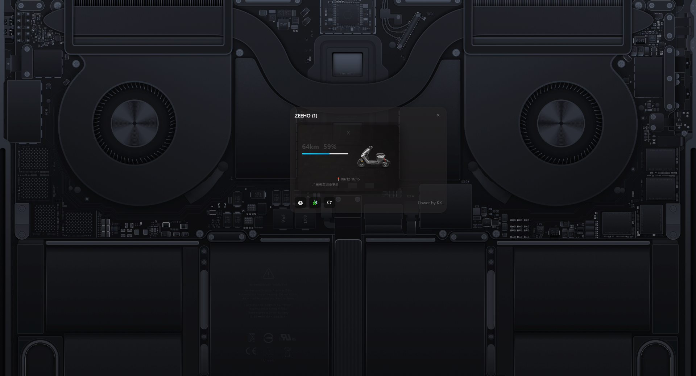

# ZEEHO 小部件

一个用于显示极核（ZEEHO）电动摩托车状态的桌面小部件应用程序。



中文文档 | [English](./README.md)

## 功能特点

-   🚀 实时显示车辆状态信息
-   🔋 电池电量和续航里程显示
-   📍 车辆位置信息（基于高德地图）
-   ⚡ 充电状态指示
-   🔄 自动刷新数据
-   🎨 美观的毛玻璃效果界面
-   📱 支持多车辆显示

## 系统要求

-   Windows 10/11
-   需要网络连接获取车辆数据

## 快速开始

### 第一步：获取 Token

#### 方法一：使用抓包工具（推荐）

1. **下载并安装抓包工具**

    - 推荐使用 [Charles](https://www.charlesproxy.com/) 或 [Fiddler](https://www.telerik.com/fiddler)
    - 或者使用手机端抓包工具如 [HttpCanary](https://httpcanary.com/)（Android）

2. **配置手机代理**

    - 确保手机和电脑在同一WiFi网络下
    - 在手机WiFi设置中配置HTTP代理
    - 代理服务器：电脑IP地址
    - 端口：抓包工具默认端口（Charles: 8888，Fiddler: 8888）

3. **安装证书（HTTPS抓包）**

    - 在抓包工具中生成并安装SSL证书
    - 手机浏览器访问 `chls.pro/ssl`（Charles）或对应证书下载页面
    - 下载并安装证书到手机

4. **开始抓包**

    - 启动抓包工具
    - 在手机上打开极核APP
    - 登录你的账号

5. **找到Token**
    - 在抓包工具中查找包含 `tapi.zeehoev.com` 的请求
    - 找到任意一个API请求，查看请求头
    - 复制 `Authorization` 字段中的值，格式为 `Bearer xxxxxxxxxx`
    - **重要**：只需要复制 `Bearer ` 后面的部分作为Token

#### 方法二：浏览器开发者工具

1. **使用电脑浏览器**

    - 打开Chrome或Edge浏览器
    - 按F12打开开发者工具
    - 切换到Network（网络）标签页

2. **访问极核官网**

    - 访问 [极核官网](https://www.zeehoev.com/)
    - 尝试登录（如果有网页版登录）

3. **查找Token**
    - 在Network标签中找到包含认证信息的请求
    - 查看请求头中的Authorization字段

### 第二步：配置软件

1. **启动应用程序**

    - 双击 `zeeho-widgets.exe` 启动程序
    - 首次启动会自动弹出配置窗口

2. **填写配置信息**

    - **Token**：粘贴从抓包获取的Token（不包含"Bearer "前缀）
    - **更新间隔**：设置数据刷新间隔（建议5-10分钟）

3. **保存配置**
    - 点击"保存配置"按钮
    - 系统会自动验证Token的有效性
    - 验证成功后会自动加载车辆数据

### 第三步：使用小部件

1. **查看车辆信息**

    - 主界面显示所有绑定车辆
    - 每个车辆卡片显示：
        - 车辆名称
        - 电池电量百分比
        - 剩余续航里程
        - 充电状态（如果正在充电）
        - 最后位置信息

2. **控制按钮**
    - ⚙️ **设置**：重新打开配置窗口
    - 🧩 **小部件**：启动桌面小部件模式
    - ⟳ **刷新**：手动刷新数据
    - × **关闭**：退出程序

## 详细配置说明

### Token 获取详细步骤

#### 使用 Charles 抓包（详细步骤）

1. **下载安装Charles**

    ```
    官网：https://www.charlesproxy.com/
    免费试用30天，每次使用30分钟
    ```

2. **配置Charles**

    - 启动Charles
    - 菜单：Proxy → Proxy Settings
    - 确认端口为8888（默认）
    - 勾选"Enable transparent HTTP proxying"

3. **手机代理设置**

    - 手机连接WiFi
    - 长按WiFi名称 → 修改网络
    - 高级选项 → 代理 → 手动
    - 代理主机名：电脑IP地址（Charles界面会显示）
    - 代理端口：8888

4. **安装SSL证书**

    - 手机浏览器访问：`chls.pro/ssl`
    - 下载证书并安装
    - Android：设置 → 安全 → 加密与凭据 → 安装证书
    - iOS：设置 → 通用 → 描述文件 → 安装证书

5. **开始抓包**
    - Charles中点击开始录制
    - 手机打开极核APP并登录
    - 在Charles中找到 `tapi.zeehoev.com` 相关请求
    - 点击请求 → 查看Request → Headers
    - 复制Authorization字段的值（去掉"Bearer "前缀）

#### 使用 HttpCanary 抓包（Android推荐）

1. **安装应用**

    - 下载HttpCanary（黄鸟抓包）
    - 给予必要权限

2. **配置抓包**

    - 打开HttpCanary
    - 点击右下角播放按钮开始抓包
    - 安装CA证书（按提示操作）

3. **获取Token**
    - 切换到极核APP
    - 进行登录或刷新操作
    - 返回HttpCanary查看抓包记录
    - 找到 `tapi.zeehoev.com` 的请求
    - 查看请求详情中的Authorization头

### 配置文件说明

配置文件保存在：`%USERPROFILE%\.zeeho-config.json`

```json
{
    "token": "your_token_here",
    "vehicleId": "",
    "updateInterval": 5
}
```

-   `token`: 从抓包获取的认证令牌
-   `vehicleId`: 车架号（可选，留空会显示所有车辆）
-   `updateInterval`: 数据更新间隔（分钟）

## 故障排除

### 常见问题

1. **Token验证失败**

    - 确认Token复制完整，没有多余空格
    - 确认Token没有包含"Bearer "前缀
    - Token可能已过期，需要重新获取

2. **无法获取车辆数据**

    - 检查网络连接
    - 确认极核APP能正常使用
    - 尝试重新获取Token

3. **抓包无法获取HTTPS数据**

    - 确认已正确安装SSL证书
    - 检查证书是否被信任
    - 尝试重启手机后再次抓包

4. **程序启动失败**
    - 确认系统版本支持（Windows 10/11）
    - 检查是否被杀毒软件误报
    - 尝试以管理员身份运行

### Token 有效期说明

-   Token通常有一定的有效期
-   如果出现认证失败，可能需要重新获取Token
-   建议定期更新Token以确保程序正常运行

### 安全提示

-   Token包含敏感信息，请勿泄露给他人
-   建议定期更改极核账号密码
-   不要在公共网络环境下进行抓包操作

## 开发说明

本项目基于以下技术栈：

-   后端：Go + Wails v2框架
-   前端：Vue 3 + Vite
-   界面：现代化毛玻璃效果设计

### 编译运行

```bash
# 安装依赖
go mod tidy
cd frontend && npm install

# 开发模式
wails dev

# 构建生产版本
wails build
```

## 许可证

本项目仅供学习和个人使用，请勿用于商业用途。

## 更新日志

### v1.0.0

-   首次发布
-   支持多车辆显示
-   实时数据刷新
-   美观的界面设计

## 联系方式

如有问题或建议，请通过以下方式联系：

-   项目Issues：提交问题和建议
-   开发者：Power by KK

---

**免责声明**：本软件仅用于个人学习和研究目的，使用本软件产生的任何后果由用户自行承担。请确保遵守相关服务条款和法律法规。
